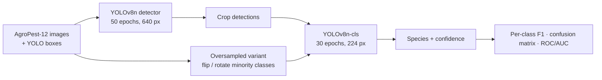

# Agricultural Pest Detection with YOLOv8

> Team project for UNSW COMP9517 Computer Vision (Term 3, 2025), shown here for portfolio purposes. Source code is kept private under university academic-integrity rules; **source available on request**.

Two-stage pipeline for field pest images: a YOLOv8n detector localises insects, crops are passed to a YOLOv8n-cls classifier for the species. Trained on AgroPest-12 (about 11k images, 12 classes: ants, bees, beetles, caterpillars, earthworms, earwigs, grasshoppers, moths, slugs, snails, wasps, weevils).

## Results

- **Detection mAP@0.5 0.77** (YOLOv8n, 50 epochs, 640 px); **classification accuracy 0.87, macro-F1 0.87** on the held-out test split (YOLOv8n-cls on detector crops, 224 px).
- **Oversampling was a negative result**: a flip / rotation oversampling scheme for the minority classes was designed, trained and evaluated with per-class F1, confusion matrices and ROC / AUC; macro-F1 moved from 0.869 to 0.844, so the un-augmented model was kept and the analysis went into the report.
- Companion comparison in the individual report: YOLOv8n vs Faster R-CNN vs SSD-Lite (ResNet-18) on the same data.

## My role

Model training lead in a team: detector and classifier training on Colab, the crop-and-classify pipeline, the oversampling experiment, and the scikit-learn evaluation toolchain (per-class report, confusion matrices, ROC / AUC) used across the team report.

## Pipeline

## Tech stack

Python · Ultralytics YOLOv8 · PyTorch · scikit-learn · OpenCV · Google Colab GPU

## Data

AgroPest-12 (TODO-CONFIRM source URL and licence). Not redistributed here.

## Contributors

Team project; my part is described above.
